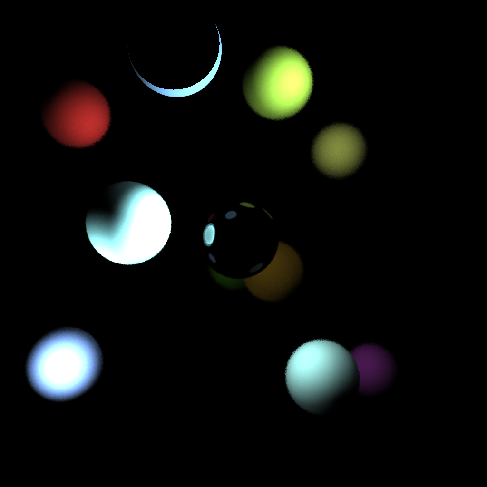

# SimulationLumiere
 
## Description du projet
L’objectif de ce projet est de calculer la lumière en fonction de plusieurs lampes disposées arbitrairement dans la scène. Pour cela, des rayons sont tirés en direction de la scène depuis un point “caméra”. Lorsqu’une sphère est touchée, un rayon est tiré en direction de chacune des lampes afin de savoir si des lampes éclairent la sphère et, le cas échéant, à quelle distance elles se trouvent . Le pixel de l’image correspondant au point d’intersection entre le premier rayon et la sphère est coloré en fonction de la couleur de la sphère et de l’intensité de la lumière. Les sphères miroirs reflètent les sphères voisines et font rebondir les rayons qui les atteignent. De plus, l’utilisation de la perspective permet de retranscrire la profondeur sur l’image finale.

Afin d’optimiser les calculs, les sphères entourées par des boîtes englobantes. Ces dernières sont elles-mêmes disposées dans une structure de données récursive: les boîtes englobantes sont contenues dans une boîte plus grande, elle-même dans une boîte plus grande etc, jusqu’à parvenir à une boîte contenant toute la scène. Ainsi, plutôt que de tester l’intersection d’un rayon avec toutes les sphères pour savoir lesquelles se trouvent sur son chemin, il est possible de tester récursivement l’intersection avec les boîtes de plus en plus petites. Cela permet d’éliminer d’office toutes les sphères contenues par des boîtes ne se trouvant pas sur le chemin du rayon et de gagner un temps énorme d’exécution.

## Résultats
Dans cette partie, nous décrivons l'efficacité de la structure de données pour un grand nombres de sphères.

Voir Rapport et TempsExec
